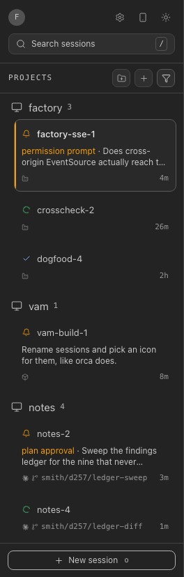
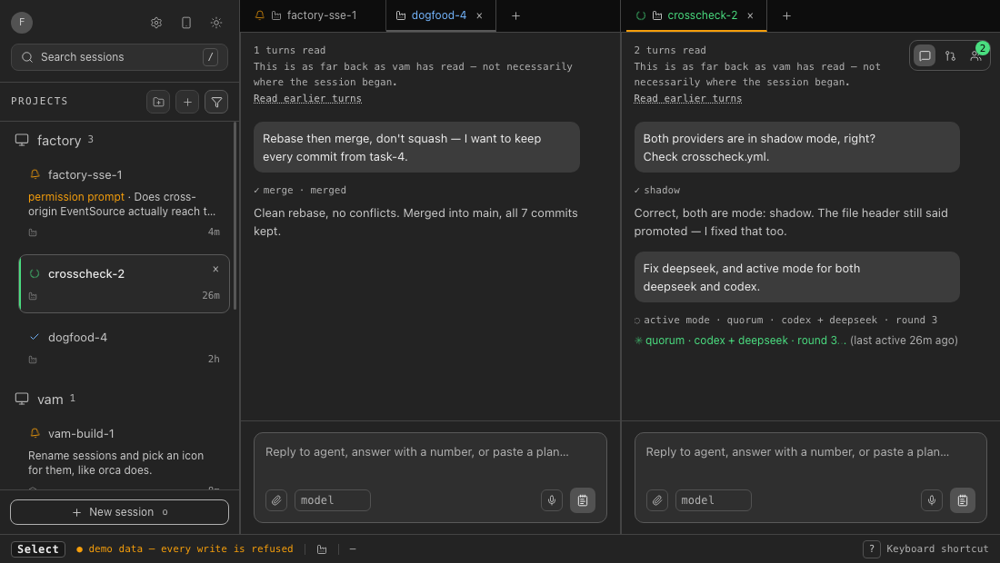
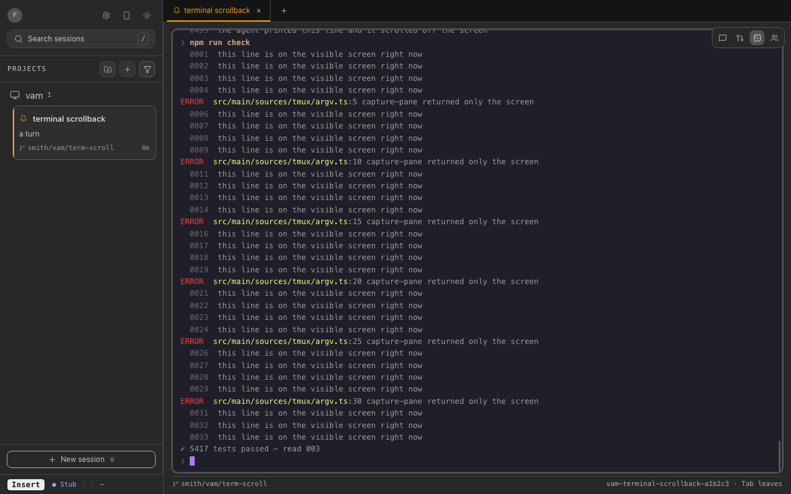
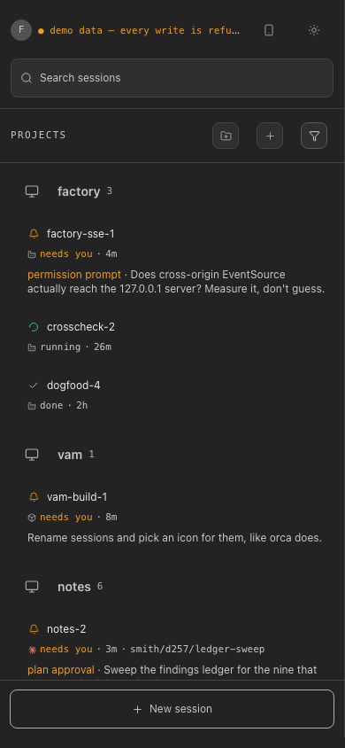

# vam — VIM Agent Management

A keyboard-first ADE for coding agents: every Claude Code and Codex session you
have running, on one screen, coloured by which one needs you, driven with vim
keys instead of a mouse.


[](LICENSE)


vam does not run agents and does not orchestrate anything. It is a read/write
window onto sessions that already exist: it reads their transcripts, surfaces
the one that stalled, and types your answer back into the pane it runs in.

## What it does

### Two sources, one list

Claude Code and Codex both ship, and the desktop app reads both at once — each
row says which it came from. A source declares what it can do as data, and the
UI draws only what it claims, so a missing capability is an absent control
rather than a button that apologises.



### Sessions are tabs, and tabs split

Every project group in the sidebar holds its live sessions as a strip of tabs.
`zs` stacks a tab into a second pane, `zv` puts it side by side, and dragging a
tab onto the detail pane does the same. Each pane keeps its own strip.



### A palette that knows who is waiting

`Mod-k` opens a jump list of every session, grouped into "needs you" and "all
sessions".


### The terminal, not a story about it

For a session vam started, the Terminal view is the real tmux pane — the screen
plus the last 500 lines of scrollback, in one `capture-pane`. It stays pinned
to the live end while the agent works, and lets go when you scroll up.



### The subagents it is running

The Agents view is a navigator: the roster on the left, and the one you picked
on the right, with its own IN/OUT and progress rather than the `●3` badge it
collapses to elsewhere.


### The files no transcript should touch

The Files view puts the session's working directory beside a plain editor —
`.env` and the config files next to it, without leaving vam. A save carries the
size, mtime and hash the file had when you opened it, so an agent writing
underneath you gets a refusal instead of an overwrite.


### Answer from your phone

The desktop app serves the same sessions to a phone. The server binds loopback
only; **Enable phone access** runs `tailscale serve`, which puts it on your
tailnet over real TLS. Pairing is a short code typed on the phone once, and
any device can be revoked.



### Attach a file to a prompt

The composer reads a text file locally and folds it into the prompt. vam
uploads nothing. The desktop app can attach an image too, through a native
picker that validates the path against the session's own directory.


## Also in the box

- **Demo mode** — `?demo=1` is a fictional fixture with every write refused, so
  a fresh clone has something to look at with no setup.
- **A PRs view** — `gh pr list` on the session's branch, with merge and
  delete-branch actions. "None" and "could not ask" are different answers.
- **Find anything** — `/` searches, `f` drops jump labels, `F` filters the
  sidebar, `p` reveals a session's project.
- **Focus view** — `zf` folds every turn's tool calls away, leaving the
  prompts and the answers.
- **Settings** — light and dark, twelve terminal colour schemes, a narrowed
  reading column for the answer, the keyboard sheet.
- **An error log** — `E` lists every genuine failure; Report composes a
  scrubbed GitHub issue and opens the form for you to submit yourself.
- **An update check** — one request to this repo's releases at launch, and vam
  downloads nothing: it opens the release page.

## Install

There are no published releases yet, so the only install is a build. Node >= 22
(`.nvmrc` pins the version CI uses):

```bash
pnpm install
pnpm run dist   # electron-vite build + the web build + electron-builder
```

That produces a `.dmg`/`.zip` on macOS and an AppImage on Linux. **Nothing is
code-signed**, so the first launch is interrupted: on macOS, right-click →
**Open** or `xattr -cr /path/to/vam.app`; on Linux, `chmod +x` the AppImage.
[docs/signing.md](docs/signing.md) is what signing would take.

electron-builder is still configured to emit an NSIS installer, and it builds
— but nothing in `src/main/sources/tmux/` has a Windows path, and desktop mode
runs every session through tmux. Treat that target as unfinished rather than
supported.

Desktop mode needs the `claude` CLI on `PATH`, and `tmux` — vam starts each
session in its own tmux pane and types your prompts into it. Codex threads are
read from `~/.codex`; `codex queue` is the one write.

## Development

```bash
pnpm run dev             # the browser build on :5273
pnpm run dev:app         # the Electron shell, hot-reloading
pnpm run build:app       # build main/preload/renderer into out/
pnpm run lint            # biome check .
pnpm run typecheck       # tsc --noEmit  (see also :node, :web, :test)
pnpm run test            # vitest run
```

`e2e/` installs its own Playwright, outside the root lockfile. Three of CI's
four jobs run from it on every push — the web guards in real Chromium, the
desktop and 390px phone suites, and one test against an actual packaged
Electron app — so a green `vitest` is not a green gate. The one harness that
is hand-run is the SSE-drop spec, and `e2e/README.md` is about that one.

## Keyboard

`Mod` is your platform's command modifier: Cmd on macOS, Ctrl elsewhere. The
ten you will use first:

| Key | Action |
|---|---|
| `j` `k` | Walk the session list |
| `h` `l` | Cycle the focused project's open tabs |
| `i` | Put the caret in the prompt box |
| `o` | Start a session in the focused project |
| `x` | Close the focused session |
| `/` | Search sessions |
| `Mod-k` | Open the command palette |
| `Ctrl-Alt-1` … `Ctrl-Alt-5` | Response, PRs, Terminal, Agents, Files |
| `zs` `zv` | Split the focused tab, stacked or side by side |
| `?` | The in-app sheet, generated from the same bindings |

**[docs/keyboard.md](docs/keyboard.md) is the full reference** — every chord,
the Files tab's own keyboard, and which fifteen a browser keeps for itself.

## Architecture

- `src/main/` — the Electron main process: the sources, tmux, the files bridge,
  the loopback server for the phone.
- `src/renderer/` — the React shell: sidebar, panes, views, and the keyboard
  grammar in `keyboard/chords.ts`.
- `src/renderer/sources/port.ts` — the contract every source implements.
  Capabilities travel as data; nothing else may ask which source it is on.
- `src/shared/` — the types both processes read; `e2e/` — hand-run Playwright.
- `docs/design/` — the records behind the bigger calls, including [where
  session ownership is going](docs/design/vam-owns-the-session.md): a design,
  not a description of what ships.

## Licence

[MIT](LICENSE).
