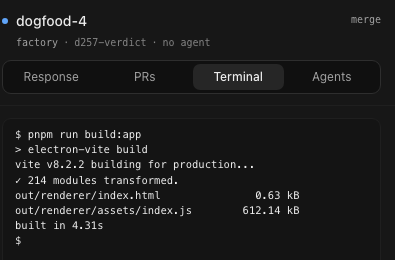
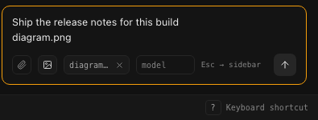

# vam — VIM Agent Management

vam is a keyboard-first canvas ADE (agent development environment) for
watching and steering coding-agent sessions: one screen that lays out every
running session as a node, colours it by whether it needs you, and lets you
navigate and act on it with vim-style keys instead of a mouse. vam runs on
its own — it ships with a real, built-in source (your own Claude Code
sessions) and does not require any other project to be installed or running.


## What this is

Running several agents at once turns into a stream of terminals to babysit
for the one moment each of them stalls and needs a person. vam's job is to
collapse that into a single canvas — one node per session, grouped by
project, coloured `running` / `waiting` / `done` / `failed` — and to make the
`waiting` state impossible to miss, so getting from "something needs me" to
looking at it and answering it takes as few keystrokes as possible.

vam is source-agnostic by design: the canvas, the keyboard layer and the
domain model (`src/renderer/domain/model.ts`) know nothing about any one
backend. What a source can do — read live, deliver a prompt, open a
terminal, and so on — travels as data (`SourceCapabilities`,
`src/renderer/sources/port.ts`), and the UI only ever draws what the active
source actually declares. Three sources ship today: your own Claude Code
sessions (desktop only), a small bundled sample (fictional data, for a
first look with no setup), and an HTTP adapter for a compatible backend —
see [Sources](#sources) below.

vam does not run agents and does not orchestrate anything. It is a
read/write window onto a session log that must already exist somewhere.

## Screenshots

`Mod-k` opens a command palette (`cmdk`) with a jump list of every session,
grouped into "needs you" and "all sessions":


A session's Terminal tab shows the screen of the tmux pane vam started for
it — a snapshot with the agent's own colours, not a live stream:



The composer can attach a text file (read locally, folded into the prompt)
or an image (validated against the session's own directory, its path put on
its own line); vam uploads nothing in either case:



## Install

**The v0.1.0 binaries are not code-signed yet**, so the OS will interrupt the
first launch:

- **macOS** blocks the app outright ("*.app* is damaged and can't be
  opened" or similar). Right-click the app → **Open**, or clear the
  quarantine flag yourself: `xattr -cr /path/to/vam.app`.
- **Windows** SmartScreen shows "Windows protected your PC". Click
  **More info**, then **Run anyway**.
- **Linux** AppImage needs the executable bit set first:
  `chmod +x vam-*.AppImage`, then run it.

None of this means the build is untrusted in some deeper sense — it means
nobody has paid a certificate authority yet. If that is not acceptable, build
from source instead:

```bash
pnpm install
pnpm run dist   # electron-vite build + the web build + electron-builder
```

## Quick start

Requires Node >=22 (`.nvmrc` pins the exact version CI uses).

### Demo mode — no backend, no setup

```bash
pnpm run dev
# open http://127.0.0.1:5273/?demo=1
```

Demo mode renders a fixed fixture (`src/renderer/fixtures/demo.ts`) — fictional
sessions, not a connection to anything. Every write is refused before it
reaches any server, and the canvas shows a banner saying so. This is for
looking at the interaction model, not for recording anything real.

### Desktop mode — against your own Claude Code sessions

```bash
pnpm run dev:app     # hot-reloading Electron shell
# or, once you have built with `pnpm run dist` / `pnpm run build:app`:
node_modules/.bin/electron .
```

**This is the only mode that shows your own sessions**, and the only one
that can *deliver* a prompt rather than just record one. The desktop shell
reads Claude Code directly — `claude agents --json --all` for the live
session list, and each session's own transcript for its timeline — with no
server of any kind in front of it.

Desktop mode delivers a prompt with `claude --resume <sessionId> -p "<prompt>"
--output-format json`. Two things it deliberately never does: it never passes
`--fork-session`, so a prompt reaches the session you aimed at or none, never
a branched copy of it; and it checks the `session_id` the CLI hands back
against the one it addressed, refusing to report delivery if they differ.

The one requirement is the `claude` CLI on `PATH` — nothing here is gated on
an operating system.

## Sources

Every source implements one contract (`SessionSource`,
`src/renderer/sources/port.ts`) and describes itself with twelve booleans —
`liveUpdates`, `recordPrompt`, `deliverPrompt`, `terminal`, and so on — plus a
plain-English reason for every one that is `false`. The UI reads that
descriptor rather than asking "which source is this," so a capability that
does not exist is simply absent, never a button that apologises when
clicked.

That is why the prompt composer sometimes says **"send prompt"** and
sometimes **"record prompt"**: it reads `capabilities.deliverPrompt` off the
active source, not which screen it is drawn in. Claude Code declares
`deliverPrompt: true` (see Desktop mode above); a source with no channel into
a running agent declares `recordPrompt` only, and the composer's wording
follows that declaration exactly.

Three sources exist in this repo:

- **`claude-code`** — your own sessions, desktop-only (`src/main/sources/claude-code/`).
- **`bundled-sample`** — fictional data with every capability `false`, used
  as `test/electron/launch.test.ts`'s fixture and as a safe first screen
  before Claude Code is wired up (`src/main/sources/fixture-source.ts`).
- **`factory`** — an HTTP adapter (`src/renderer/sources/http-factory.ts`)
  for a remote backend that speaks five routes (`GET /api/describe`,
  `GET /api/load`, `GET /api/stream` for live updates, `POST
  /api/record-prompt`, and so on, gated by the same capability flags). This
  is the shape vam's own maintainers dogfood it against; the server on the
  other end is not part of this repository and is not published. Demo mode
  above renders the same shape from a static fixture instead of a real one,
  which is the closest a fresh clone gets to seeing it without standing up a
  server of your own.

Adding a fourth source means implementing `SessionSource` (or, from the
Electron main process, the smaller `MainSource` in
`src/main/sources/source.ts`) and declaring its own capabilities — nothing
elsewhere needs to change, because nothing elsewhere is allowed to assume
which source it is looking at.

## Mobile

The desktop app can serve the same canvas to a phone. The server
(`src/main/remote/server.ts`) binds **loopback only** — it is never directly
reachable from another machine. Settings → Remote has an **Enable phone
access** button that runs `tailscale serve` for you; that proxies the
loopback server from your tailnet and terminates TLS, so the phone gets a
real `https://<something>.ts.net` origin rather than a bare local address.
The same panel turns it off again, and it is off until you ask — exposing a
port to your whole tailnet should not be a side effect of opening a screen.

One thing that catches people out: **Serve is disabled by default on a
tailnet**, and switching it on is a web action an admin takes in the
Tailscale console, not something any app can do for you. When that is the
situation, vam says so and shows you the link rather than reporting a
generic failure. Without Tailscale installed at all, the panel explains why
and links the download; it does not offer a plaintext fallback over the
local network, because a bare `http://` origin is not a secure context and
would quietly disqualify browser notifications later.

Pairing is by a short code shown on the desktop (Settings → Remote), typed
into the phone once; each paired device can be revoked individually, or all
at once. The phone client itself ships **inside** the packaged desktop
app — nothing extra to build or serve.

## Keyboard reference

Bindings are defined in `src/renderer/keyboard/chords.ts`. The table below
is hand-maintained, but not merely trusted: `test/keyboard/chords.readme.test.ts`
reads `chords.ts`'s own binding tables and this file's `Key`/`Chord` columns
and fails `vitest run` the moment either side names something the other
doesn't — the same source the in-app `?` sheet is generated from. `hjkl`
move the focused node the way they always do; `Mod` means Ctrl or Cmd,
whichever your platform uses.

| Key | Action |
|---|---|
| `h` `j` `k` `l` | Move focus left / down / up / right |
| `i` | Put the caret in the prompt box, aimed at the focused session |
| `I` | Move keyboard control into the right-hand action pane |
| `H` | Move keyboard control back to the session list |
| `r` | Rename the focused session |
| `s` | Pick the focused session's icon |
| `x` / `Mod-w` | Close the focused session |
| `o` / `Mod-n` | Start a new session |
| `,` | Open settings |
| `.` | Open Remote — pair a phone, approve or deny it, unpair one, or revoke every device |
| `E` | Open the error log and the report vam can compose from it |
| `?` | Open the in-app shortcut sheet (generated from these same bindings) |
| `f` | Jump (open the jump-label overlay) |
| `F` | Open the sidebar's filter popover |
| `G` | Jump to the last session |
| `/` | Search sessions |
| `n` / `N` | Next / previous search match |
| `p` | Reveal the focused session's project in the sidebar |
| `Enter` | Open the focused step |
| `Mod-k` | Open the command palette |
| `Mod-1` `Mod-2` `Mod-3` `Mod-4` `Mod-5` `Mod-6` `Mod-7` `Mod-8` `Mod-9` | Jump to a position — a session in the sidebar, or a tab in the response pane, whichever pane has the keyboard (`Mod-9` is always the last one) |
| `Alt-1` `Alt-2` `Alt-3` `Alt-4` | Show a view in the focused pane — Response, PRs, Terminal, Agents, in that fixed order. A digit always names the SAME view: if this source has no terminal, `Alt-3` says so rather than opening whatever sits third |
| `Alt-5` `Alt-6` `Alt-7` `Alt-8` `Alt-9` | Nothing — bound only so they say there is no fifth view instead of reaching the browser |
| `<` / `>` | Narrow / widen the focused side pane |
| `Escape` | Cancel whatever is half-typed |

Chord prefixes — press the first key, then the second:

| Chord | Action |
|---|---|
| `gg` | Jump to the first session |
| `gt` / `gT` | Next / previous project |
| `gm` | Move the focused session's project into a folder, or out of one |
| `yy` | Copy the focused step's commands |
| `z0` | Reset both panes to their default widths and bring back any hidden pane |
| `zs` / `zv` | Split the focused tab — `zs` horizontally (stacked), `zv` vertically (side by side); dragging a tab onto the detail pane does the same, and only within one project |
| `zc` | Close the focused split — the session keeps running |
| `zw` / `zW` | Move the keyboard to the next / previous split |

## Development

```bash
pnpm run dev             # start the dev server on :5273
pnpm run build           # production build
pnpm run preview         # serve the production build on :5274
pnpm run dev:app         # Electron shell with hot reload
pnpm run build:app       # build main/preload/renderer into out/
pnpm run dist            # the packaged, distributable build
pnpm run test:app        # boot the packaged app and assert it opens a window
pnpm run typecheck       # tsc --noEmit
pnpm run typecheck:test  # typecheck the test sources
pnpm run lint            # biome check .
pnpm run test            # vitest run
pnpm run test:coverage   # vitest run --coverage
```

Tests use Vitest; run a single file directly with
`node_modules/.bin/vitest run <path>` if you don't want the whole suite.

### End-to-end tests

The Playwright suites in `e2e/` need a one-time manual setup and are **not**
covered by `pnpm install`: there is deliberately no `e2e/package.json`, so a
fresh clone has no `e2e/node_modules` and the scripts below will not run
until you create one. `e2e/README.md` has the steps and explains why the
layout is this way.

Once the harness exists:

```bash
pnpm run test:e2e            # the canvas suite
pnpm run test:e2e:reconnect  # the SSE drop/reconnect suite
pnpm run test:e2e:phone      # the phone shell suite
pnpm run test:e2e:electron   # the packaged-app launch suite
```

None of these run in CI — they are hand-run only, by design: `e2e/` is
excluded from every automated gate, and `.github/workflows/ci.yml` says so in
its header rather than leaving the gap unexplained.

## Project status

`package.json` is at `0.1.0` and marked `private` so it can't be published to
npm by accident — vam is an application, not a library, which is separate
from the licence below.

## Licence

[MIT](LICENSE).
