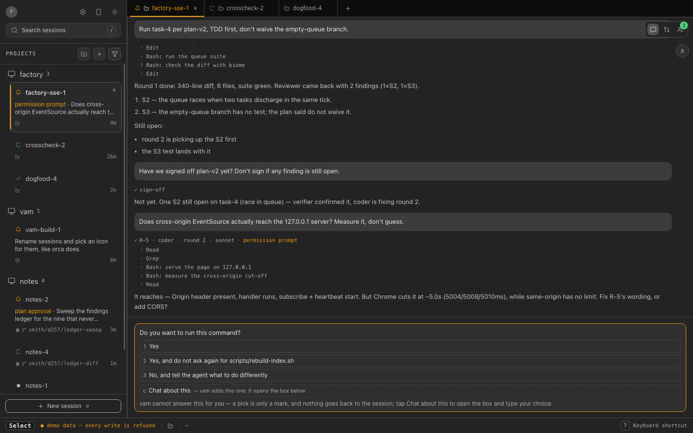
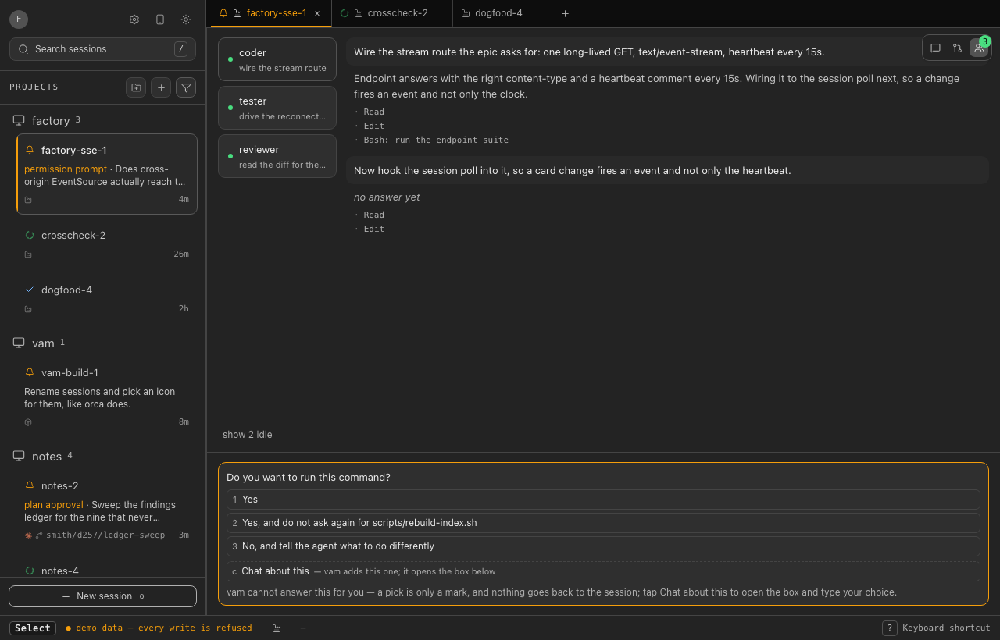
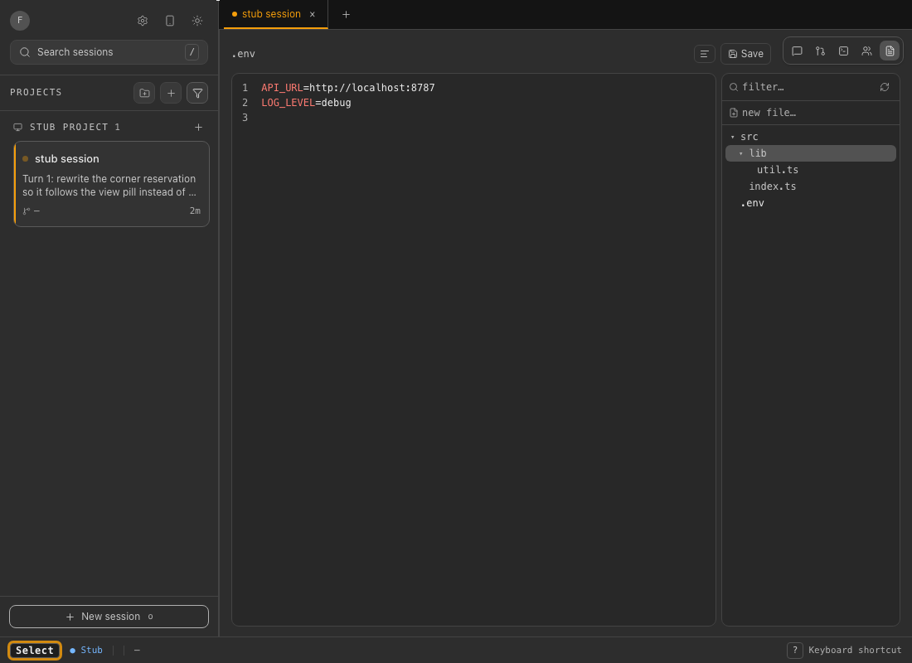
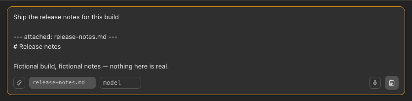

# vam — VIM Agent Management

vam is a keyboard-first ADE (agent development environment) for watching and
steering coding-agent sessions: one screen that lists every running session,
colours it by whether it needs you, and lets you navigate and act on it with
vim-style keys instead of a mouse. vam runs on
its own — it ships with a real, built-in source (your own Claude Code
sessions) and does not require any other project to be installed or running.



## What this is

Running several agents at once turns into a stream of terminals to babysit
for the one moment each of them stalls and needs a person. vam's job is to
collapse that into a single screen — one row per session, grouped by
project, coloured `running` / `waiting` / `done` / `failed` — and to make the
`waiting` state impossible to miss, so getting from "something needs me" to
looking at it and answering it takes as few keystrokes as possible.

vam is source-agnostic by design: the shell, the keyboard layer and the
domain model (`src/renderer/domain/model.ts`) know nothing about any one
backend. What a source can do — read live, deliver a prompt, open a
terminal, and so on — travels as data (`SourceCapabilities`,
`src/renderer/sources/port.ts`), and the UI only ever draws what the active
source actually declares. Three sources ship today: your own Claude Code
sessions (desktop only), a small bundled sample (fictional data, for a
first look with no setup), and an HTTP adapter for a compatible backend —
see [Sources](#sources) below.

vam does not run agents and does not orchestrate anything. It is a
read/write window onto a session log that must already exist somewhere.

Every project group in the sidebar holds its live sessions as a strip of
tabs — the shape that replaced an earlier node-graph canvas in the 0.2
rewrite — and splitting one tab into two panes (`zs` stacked, `zv` side by
side, or dragging a tab onto the detail pane) is how more than one shows on
screen at once. Starting a session (`o` / `Mod-n`, or a project's own `+`)
draws its own "starting a session in *project*…" row while vam waits for
the first read back — even for a brand-new project, which has no section in
the sidebar to hold it yet — and a source that has not answered its very
first list at all shows `Loading sessions…` instead of a bare empty list, so
a project that is genuinely empty is never mistaken for one still starting
up.

Closing a session (`x` / `Mod-w`) only ever kills the tmux pane vam itself
started for it. vam refuses outright, by name, anything it cannot prove is
its own — a pane it never started (`not-vam-started`) or an ambiguous case
where more than one live session shares a project — rather than guessing;
the refusal offers a confirmed force-kill by process id where one exists,
re-verified alive at the moment of confirmation, and still declines if that
check fails.

## Screenshots

`Mod-k` opens a command palette (`cmdk`) with a jump list of every session,
grouped into "needs you" and "all sessions":


A session's Agents tab is a navigator: the roster of subagents it is
running on the left, and on the right the one you picked — its own IN/OUT
and progress, not just the `●3` badge it collapses to elsewhere. Its PRs tab
asks GitHub for open pull requests on the session's own branch, and says so
plainly when it can't ask at all or asked and found none — never one empty
list standing in for both. (A session started by vam also has a Terminal
tab, a polled snapshot of the tmux pane vam started for it rather than a
live stream — the screen **and the last 500 lines of its scrollback**,
fetched in one `capture-pane` so no line can fall between two reads. It
stays pinned to the live end while the agent works and lets go the moment
you scroll up, and `Mod-d` / `Mod-u`, the wheel and Home/End all move it.
The colours are yours: Settings → Appearance carries a terminal theme —
twelve of them, Hans in the dark and Tango Light in the light — every one
of the scheme's 23 colours as its own swatch, and the ground's opacity.
See the keyboard reference below. That tab is withdrawn, not merely empty,
for any source that cannot reach a terminal —
which the phone/remote endpoint deliberately never can: reading, sending,
answering and resizing a running agent's pane each need their own rate
limit and their own decision, so `src/main/remote/server.ts`'s own
`UNSERVED` table turns the capability off outright rather than exposing a
route it isn't ready to carry.)



A Files tab sits beside them: the session's own working directory as a tree
on the right, and a plain editor for the open file in the middle — both on
screen at once, so opening the next file is not a round trip through a
screen that hides the one you are editing. It exists for the files no
transcript is the right place to touch — `.env` and the handful of config
files beside it — so dotfiles are never hidden from the tree, only
`node_modules` and `.git` are skipped, and symlinks are neither listed nor
followed. Typing in the tree's filter box narrows it to the files that
match and the directories that lead to them, still as a tree: `src/index.ts`
and `docs/index.ts` are two different files, and a flat row reading
`index.ts` twice could not say which is which. The whole tree is walkable
from the keyboard — `j`/`k` down and up, `l`/`h` in and out, `Enter` to open
a file and land in the editor, `Mod-Shift-e` to cross back — and every one
of those is in the table under *In the Files tab* below. There is no editor
library behind it — the colours are vam's own, and so is the formatter.

Both are drawn only where vam is sure, because a highlighter that
mis-tokenises unfamiliar syntax is a worse lie than drawing none, and a
formatter that mangles a file is worse than no formatter at all. So JSON,
`.env`, `.ini` and markdown are coloured and everything else renders as plain
text; `Mod-Shift-f` reformats a `.json` only when it can prove the result
differs from your file by whitespace alone, tidies nothing in a `.env` but its
blank lines and comments, and refuses by name everywhere else. A format is one
`Mod-z` away from being exactly undone. Appearance carries the two settings
the editor has of its own: whether to colour, and how wide one indent step is.

Markdown is the one that is coloured by its LINE STRUCTURE and by nothing
else — headings, list markers, quote rails and fence rails. No emphasis, no
link, no code span and not one byte of what is inside a fence, because none of
those can be read from the head of a line and a wrong guess about them would
be the lie the rule above is against. A fence is tracked all the same, so a
`#` line inside a shell block is not painted as a heading.

Markdown also has a second view. The toggle beside Format — or `Mod-Shift-m` —
swaps the raw text for the file **rendered**, GitHub-flavoured, through the
same renderer the Response tab dresses an agent's answer with: the same tables,
the same fenced-code colours, the same refusal to turn raw HTML in the text into
DOM. It is read-only, and your unsaved edits survive the switch in both
directions. The tree beside it marks families with a glyph — folder, JSON,
config, code, image, document — and spends a colour on only the four file types
vam actually has something to offer for, so a real repository reads as mostly
grey with the `.env` you were looking for standing out of it.

What it does take seriously is that an agent is editing these files while
you have them open. A save carries the size, mtime and hash the file had
when you opened it; if any of them moved, the write is refused rather than
landing on top of whatever was just written, your own edit stays in the box,
and `Reload` is the only thing that gives it up. Unsaved text survives
switching files, switching tabs and switching sessions; quitting is the one
exit it cannot survive, so vam asks before the window closes on it. Like
the Terminal tab, this one is desktop-only and withdrawn rather than shown
empty: `UNSERVED` carries no file-read, file-write or file-listing route,
because arbitrary file access over a network is at least as serious as
typing into a running agent.



The composer can attach a text file, read locally and folded straight into
the prompt — vam uploads nothing:



The desktop app can also attach an image, opening a native file picker and
validating the answer against the session's own directory before putting its
path on its own line in the prompt text; that dialog has no browser
equivalent, so it is not pictured here — every screenshot in this README is
`?demo=1`, vam's fictional fixture, and the image picker only exists where a
real session and a real directory do.

## Install

**The v0.1.0 binaries are not code-signed yet**, so the OS will interrupt the
first launch:

- **macOS** blocks the app outright ("*.app* is damaged and can't be
  opened" or similar). Right-click the app → **Open**, or clear the
  quarantine flag yourself: `xattr -cr /path/to/vam.app`.
- **Windows** SmartScreen shows "Windows protected your PC". Click
  **More info**, then **Run anyway**.
- **Linux** AppImage needs the executable bit set first:
  `chmod +x vam-*.AppImage`, then run it.

None of this means the build is untrusted in some deeper sense — it means
nobody has paid a certificate authority yet. If that is not acceptable, build
from source instead:

```bash
pnpm install
pnpm run dist   # electron-vite build + the web build + electron-builder
```

### Signing it yourself

**This is the GitHub-release path, not the App Store one**, and they are
different pieces of work that are easy to confuse. Shipping a `.dmg` from a
GitHub release needs a **Developer ID Application** certificate and
**notarisation** — Apple checks the binary automatically, there is no review,
nobody looks at the app, and it never appears in the store. The App Store is a
different certificate (*Apple Distribution*), a sandbox vam could not run
under anyway (it spawns `tmux` and `claude`), and a human review. None of that
is needed here.

What signing buys, concretely: a notarised download opens on a double click.
An unsigned one makes every person who downloads it right-click → Open, or run
`xattr -cr`, and it is the same binary either way.

`electron-builder.config.cjs` sets `mac.identity: null` on purpose: left
unset, electron-builder signs with whatever identity happens to be in the
building machine's keychain, so the same commit produces a different artifact
on a different machine. Signing is therefore an explicit, local change rather
than something that happens by accident.

**macOS** needs two separate things, and only having both stops the warning:

1. **A Developer ID Application certificate** — an Apple Developer Program
   membership (99 USD/year), then *Certificates → Developer ID Application* in
   the developer portal, downloaded into the login keychain. `security
   find-identity -v -p codesigning` should list it.
2. **Notarisation** — Apple must see the signed app before Gatekeeper stops
   warning about it. A signed but un-notarised app still gets stopped.

In the config: drop `identity: null` (or set it to the certificate's common
name), and add `hardenedRuntime: true` with an entitlements file —
notarisation requires the hardened runtime, and an Electron app under it needs
`com.apple.security.cs.allow-jit` and
`com.apple.security.cs.allow-unsigned-executable-memory` for V8, plus
`com.apple.security.inherit` in the *child* entitlements, because vam spawns
`tmux`, `claude` and `gh`. Then `APPLE_ID`, `APPLE_APP_SPECIFIC_PASSWORD` and
`APPLE_TEAM_ID` in the environment, and `notarize: true` under `mac`;
electron-builder submits and staples the ticket itself.

**Windows** needs a code-signing certificate from a CA — an OV certificate now
ships on a hardware token, so CI signing means a cloud service (Azure Trusted
Signing, SSL.com eSigner) rather than a file on disk. SmartScreen additionally
warms up by reputation, so the first signed builds may still warn.

**Linux** AppImages have no equivalent step; there is nothing to sign.

None of the above is exercised by this repo — there is no certificate to test
it with, so treat it as the shape of the work rather than a recipe that has
been run.

The update check is already pointed at GitHub releases
(`src/main/update/check.ts` asks `/repos/juzser/vam/releases/latest`, once, at
launch, with Settings → Update as the way to ask again). That endpoint answers
404 today, which is not an error: it is "no releases have been published yet",
and the section says exactly that. Cutting the first release is what turns it
on — vam downloads nothing either way, it opens the release page in your own
browser.

## Quick start

Requires Node >=22 (`.nvmrc` pins the exact version CI uses).

### Demo mode — no backend, no setup

```bash
pnpm run dev
# open http://127.0.0.1:5273/?demo=1
```

Demo mode renders a fixed fixture (`src/renderer/fixtures/demo.ts`) — fictional
sessions, not a connection to anything. Every write is refused before it
reaches any server, and the shell shows a banner saying so. This is for
looking at the interaction model, not for recording anything real.

### Desktop mode — against your own Claude Code sessions

```bash
pnpm run dev:app     # hot-reloading Electron shell
# or, once you have built with `pnpm run dist` / `pnpm run build:app`:
node_modules/.bin/electron .
```

**This is the only mode that shows your own sessions**, and the only one
that can *deliver* a prompt rather than just record one. The desktop shell
reads Claude Code directly — `claude agents --json --all` for the live
session list, and each session's own transcript for its timeline — with no
server of any kind in front of it.

Desktop mode delivers a prompt with `claude --resume <sessionId> -p "<prompt>"
--output-format json`. Two things it deliberately never does: it never passes
`--fork-session`, so a prompt reaches the session you aimed at or none, never
a branched copy of it; and it checks the `session_id` the CLI hands back
against the one it addressed, refusing to report delivery if they differ.

The one requirement is the `claude` CLI on `PATH` — nothing here is gated on
an operating system.

## Sources

Every source implements one contract (`SessionSource`,
`src/renderer/sources/port.ts`) and describes itself with twelve booleans —
`liveUpdates`, `recordPrompt`, `deliverPrompt`, `terminal`, and so on — plus a
plain-English reason for every one that is `false`. The UI reads that
descriptor rather than asking "which source is this," so a capability that
does not exist is simply absent, never a button that apologises when
clicked.

That is why the prompt composer sometimes says **"send prompt"** and
sometimes **"record prompt"**: it reads `capabilities.deliverPrompt` off the
active source, not which screen it is drawn in. Claude Code declares
`deliverPrompt: true` (see Desktop mode above); a source with no channel into
a running agent declares `recordPrompt` only, and the composer's wording
follows that declaration exactly.

Three sources exist in this repo:

- **`claude-code`** — your own sessions, desktop-only (`src/main/sources/claude-code/`).
- **`bundled-sample`** — fictional data with every capability `false`, used
  as `test/electron/launch.test.ts`'s fixture and as a safe first screen
  before Claude Code is wired up (`src/main/sources/fixture-source.ts`).
- **`factory`** — an HTTP adapter (`src/renderer/sources/http-factory.ts`)
  for a remote backend that speaks five routes (`GET /api/describe`,
  `GET /api/load`, `GET /api/stream` for live updates, `POST
  /api/record-prompt`, and so on, gated by the same capability flags). This
  is the shape vam's own maintainers dogfood it against; the server on the
  other end is not part of this repository and is not published. Demo mode
  above renders the same shape from a static fixture instead of a real one,
  which is the closest a fresh clone gets to seeing it without standing up a
  server of your own.

Adding a fourth source means implementing `SessionSource` (or, from the
Electron main process, the smaller `MainSource` in
`src/main/sources/source.ts`) and declaring its own capabilities — nothing
elsewhere needs to change, because nothing elsewhere is allowed to assume
which source it is looking at.

## Mobile

The desktop app can serve the same sessions to a phone. The server
(`src/main/remote/server.ts`) binds **loopback only** — it is never directly
reachable from another machine. Settings → Remote has an **Enable phone
access** button that runs `tailscale serve` for you; that proxies the
loopback server from your tailnet and terminates TLS, so the phone gets a
real `https://<something>.ts.net` origin rather than a bare local address.
The same panel turns it off again, and it is off until you ask — exposing a
port to your whole tailnet should not be a side effect of opening a screen.

One thing that catches people out: **Serve is disabled by default on a
tailnet**, and switching it on is a web action an admin takes in the
Tailscale console, not something any app can do for you. When that is the
situation, vam says so and shows you the link rather than reporting a
generic failure. Without Tailscale installed at all, the panel explains why
and links the download; it does not offer a plaintext fallback over the
local network, because a bare `http://` origin is not a secure context and
would quietly disqualify browser notifications later.

Once phone access is on, the panel draws that `ts.net` address **as a QR
code** beside it, so the phone opens the link with its camera instead of
having a MagicDNS name typed into it. The encoder is ~250 lines in
`src/renderer/settings/qr.ts` rather than a dependency, and it is deliberately
narrow: byte mode, error-correction level M, versions 1-7 (122 bytes), which
is one address and nothing else. Over that ceiling it draws nothing and the
address stays in text — a blank square where a symbol should be is worse than
no square. The QR is not drawn on the phone itself, which is the device that
would be scanning it.

Pairing is by a short code shown on the desktop (Settings → Remote), typed
into the phone once; each paired device can be revoked individually, or all
at once. The code is **not** in the QR, on purpose: the address is not a
secret and pairing is what authorises a device, so putting a live credential
into a picture on a screen would trade that distinction for two seconds of
typing. The phone client itself ships **inside** the packaged desktop app —
nothing extra to build or serve.

## Keyboard reference

Bindings are defined in `src/renderer/keyboard/chords.ts`. The table below
is hand-maintained, but not merely trusted: `test/keyboard/chords.readme.test.ts`
reads `chords.ts`'s own binding tables and this file's `Key`/`Chord` columns
and fails `vitest run` the moment either side names something the other
doesn't — the same source the in-app `?` sheet is generated from. `hjkl`
mean different things in Select and Insert — there is no node-graph left for
them to move a cursor on, only the session list and the question card — and
`Mod` means **your platform's command modifier**: Cmd on macOS, Ctrl on Linux
and Windows.

**On macOS, Ctrl belongs to the terminal.** `Ctrl+K`, `Ctrl+W`, `Ctrl+U`,
`Ctrl+N` and `Ctrl+T` are readline's own chords, and vam answers none of them —
they reach the shell in the Terminal tab and the text box everywhere else.
`Ctrl+number` is bound to nothing either. The two exceptions are deliberate and
are named in the table: `Mod-d` / `Mod-u` also answer **Ctrl+D / Ctrl+U**,
because those are vim's gestures for reading a transcript rather than commands,
and `Ctrl-[` still leaves the prompt box, because that is vim's own Escape. On
Linux and Windows there is no Cmd key, so Ctrl is the command modifier and
every `Mod-` chord answers it as it always did.

| Key | Action |
|---|---|
| `h` `j` `k` `l` | **Select:** `j`/`k` walk the session list, one row at a time, stopping at the ends; `h`/`l` cycle the active project's open tabs, a ring that wraps. **Insert:** `j`/`k` walk an open question's options; `h` returns to Select, `l` steps a multi-question call's steps |
| `i` | Put the caret in the prompt box, aimed at the focused session |
| `I` | Move keyboard control into the right-hand action pane |
| `Mod-Shift-h` / `Mod-0` | Move keyboard control back to the session list. `Cmd+Shift+H` rather than `Cmd+H`, which is macOS's own Hide and is claimed by the application menu before the page ever sees it |
| `r` | Rename the focused session |
| `s` | Pick the focused session's icon |
| `x` / `Mod-w` | Close the focused session |
| `o` / `Mod-n` | Start a new session, in the focused session's project |
| `Mod-t` | Start a new session as a tab of the FOCUSED PANE — the pane's own `+`, and it names the project on screen when that pane is empty |
| `Mod-Shift-p` | New project — choose a directory, and start a session in it. There is no stored project in vam: a project is live sessions grouped by their cwd, so this is the only thing creating one can mean. `Cmd+P` is a different gesture and is bound to nothing, so the browser build keeps its print dialog |
| `,` | Open settings |
| `.` | Open Remote — pair a phone, approve or deny it, unpair one, or revoke every device |
| `E` | Open the error log — every genuine failure this session hit, never vam's own intended refusals. Each row can Copy the raw event as text, or Report it: vam composes a pre-filled GitHub issue, scrubbed of anything private, and opens the form in your browser for you to read and submit yourself — it is never sent on vam's behalf |
| `?` | Open the in-app shortcut sheet (generated from these same bindings) |
| `f` | Jump (open the jump-label overlay) |
| `F` | Open the sidebar's filter popover |
| `G` | Jump to the last session |
| `/` | Search sessions |
| `n` / `N` | Next / previous search match |
| `p` | Reveal the focused session's project in the sidebar |
| `Enter` | **Select:** nothing to open — the whole detail is already in the right pane, and it says so. **Insert:** marks the option under the cursor, or opens the prompt box |
| `Mod-k` | Open the command palette |
| `Mod-1` `Mod-2` `Mod-3` `Mod-4` `Mod-5` `Mod-6` `Mod-7` `Mod-8` `Mod-9` | Select a session tab by position, counting ACROSS every pane on screen in the order the strips draw them — the same meaning wherever the keyboard is, and picking a tab another pane holds moves the keyboard there with it. `Mod-9` is always the last one. Past nine open tabs the digits stop covering everything: that is the price of counting one list rather than one per strip, and `Mod-Shift-[` / `]` is how you reach the rest. On macOS this row is **Cmd only**: Ctrl+number used to reach it too and is bound to nothing now, so the digit row means one thing and the view row below means another |
| `Mod-Shift-[` / `Mod-Shift-]` | Previous / next session tab, over that same across-panes list, wrapping at both ends — the browser's own tab gesture, and it fires from inside the prompt box |
| `Mod-Alt-[` / `Mod-Alt-]` | Previous / next pane — one modifier up from the tab pair, and the same act as `zw` / `zW` |
| `Ctrl-Alt-1` `Ctrl-Alt-2` `Ctrl-Alt-3` `Ctrl-Alt-4` `Ctrl-Alt-5` | Show a view in the focused pane — Response, PRs, Terminal, Agents, Files, in that fixed order. Ctrl+Option+number on macOS, Ctrl+Alt+number elsewhere: one three-key chord, the same physical keys on every platform. A digit always names the SAME view: if this source has no terminal, `Ctrl-Alt-3` says so rather than opening whatever sits third, and `Ctrl-Alt-5` says the same on a build without the desktop file bridge. Plain Alt+number used to do this and is bound to nothing now — switching a view is the three-key chord alone |
| `Ctrl-Alt-6` `Ctrl-Alt-7` `Ctrl-Alt-8` `Ctrl-Alt-9` | Nothing — bound only so they say there is no sixth view instead of reaching the browser |
| `1` `2` `3` `4` `5` `6` `7` `8` `9` | **Select only:** the same views on one key — `3` is Terminal because Terminal is view 3, exactly as `Ctrl-Alt-3` is, and a digit past the last view refuses aloud in the same words. **In Insert a digit is text** and goes to whatever holds the caret: the prompt box, the search line, a rename field, the Files filter, a question card's option marks, and the terminal, where it is typed into the session. That is the whole difference between the two spellings, and the reason the three-key chord is still here: `Ctrl-Alt-3` switches a view *while you are writing a prompt*, and a bare `3` cannot. Matched by the KEY'S POSITION, so an AZERTY digit row works unshifted; `Shift+number` is a different keystroke and is bound to nothing. A bare `0` is bound to nothing either — the zero is `z0`'s and `Mod-0`'s |
| `Mod-d` / `Mod-u` | Half a screen down / up the FOCUSED PANE's transcript — vim's own `Ctrl-D` / `Ctrl-U`. Half the column's visible height per press, instant, clamped at both ends; scrolling to the top is what reads earlier turns in, exactly as a trackpad scroll there does. **Select only:** with the caret in the prompt box, on a question card or in the terminal these two stay that surface's own, where `Ctrl-D` is delete-forward (and EOF) and `Ctrl-U` deletes to the start of the line. **The one letter pair that answers Ctrl as well as Cmd** — every other `Mod-<letter>` is the command modifier alone, and these two kept Control because that is where a vim user's hand goes |
| `<` / `>` | Narrow / widen the focused side pane |
| `Escape` | Cancel whatever is half-typed |

Chord prefixes — press the first key, then the second:

| Chord | Action |
|---|---|
| `gg` | Jump to the first session |
| `gt` / `gT` | Next / previous project |
| `gm` | Move the focused session's project into a folder, or out of one |
| `yy` | Copy this session's newest turn's proposed commands. Against a real session there usually are none yet — the factory has no event that carries one — and the chord says so ("no command to copy") rather than copying nothing |
| `z0` | Reset both panes to their default widths |
| `zs` / `zv` | Split the focused tab — `zs` horizontally (stacked), `zv` vertically (side by side); dragging a tab onto the detail pane does the same, and only within one project |
| `zc` | Close the focused split — the session keeps running |
| `zw` / `zW` | Move the keyboard to the next / previous split |
| `zf` | Focus view on or off — fold every turn's working away (the tool calls it made, listed under its progress line), leaving your prompts and the agent's answers. A folded turn keeps `···` where its working was; press that and the turn comes back on its own. Nothing is folded from a turn whose tools failed, or from the newest turn while the session is working or waiting. `z` is vim's fold prefix and vam's display prefix, and a bare chord is contested by no browser — see *In a browser tab* below |

#### In the Files tab

The Files tab has a keyboard of its own: a file TREE on the right, an editor
in the middle, and these move between them. They are LOCAL to that tab — every
chord in the two tables above still works while the keyboard is in it, and
anything not named here falls straight through to them. A key that cannot act
says so, in the tab, rather than doing nothing.

| In the Files tab | Action |
|---|---|
| `Mod-Shift-e` | Move the keyboard between the editor and the tree — the same chord both ways, because it is one act rather than two. `Cmd+Shift+E` is what VS Code and orca both use to reach a file explorer; `Mod-e` is macOS's own "use selection for find" in every text view, so it is not free |
| `j` / `k` | Walk down / up the tree, one row at a time, stopping at the ends — the same thing they do to the session list in Select |
| `l` | Open the directory under the cursor; press it again to step into it. On a file, open it in the editor and leave the keyboard on the tree |
| `h` | Shut the directory under the cursor, or step out to the one holding it. At the top of the tree it says so rather than doing nothing |
| `Enter` | Open the file under the cursor AND put the caret in the editor. On a directory, open or shut it |
| `/` | Put the caret in the tree's filter box. `Enter` there hands the keyboard to the first matching row |
| `Mod-p` | Search the files — the same filter box, reached from ANYWHERE in the tab: the tree, the editor, the rendered markdown, either box. `/` cannot do that, because in the editor it is a character you are typing into a file. A second press selects what is already in the box, so it starts a new search rather than appending to a stale one. `Cmd+P` is "go to file" in VS Code and Sublime, and vam's own grammar leaves it unbound |
| `Tab` / `Shift-Tab` | Indent / outdent in the editor — trapped there, never a focus move, because `Escape` and `Mod-[` are both real ways out already |
| `Mod-s` | Save the open file. vam takes this before the browser's own "Save Page" |
| `Mod-Shift-f` | Format the open file — vam's own formatter, not the project's. It reformats only where it can prove it changed nothing but whitespace (`.json`, and the blank lines and comments of a `.env`/`.ini`) and names what it will not touch: pressing it on a `.ts` says so rather than doing nothing |
| `Mod-Shift-m` | Switch a markdown file between the rendered document and its raw text — the same act as the toggle beside Format. The rendered view is read-only, and unsaved edits survive the switch both ways. On any other file type it says so rather than doing nothing |
| `Mod-z` | Undo the last format, exactly, while the file is still what that format produced. Type one character and it is not vam's key any more: the browser's own undo of your typing gets it, as it always has |
| `Escape` / `Mod-[` | Hand the keyboard back to Select — from the editor, the tree, the filter box or the new-file box. Never a discard: unsaved text survives it, exactly as it survives switching files, tabs and sessions |

These are held against the code by `test/keyboard/files-tab.readme.test.ts`,
which reads the `In the Files tab` column above and the two key lists
`src/renderer/panels/files-tree.ts` actually dispatches on — so a binding
added without a row, or a row left behind by a binding that went away, fails
`vitest run` rather than reaching an operator.


#### In a browser tab

vam ships one keyboard two ways, and only one of them has the keyboard to
itself. In the **desktop app** nothing competes: vam builds its own Electron
menu and leaves out the four items whose key equivalents it wanted, so every
chord above reaches the page. Over **Tailscale Serve** the page is a tab in
Chrome or Safari, and fifteen of these are chords the browser keeps for
itself — zoom, tab selection, and the tab and window lifecycle:

`Mod-0` `Mod-1` `Mod-2` `Mod-3` `Mod-4` `Mod-5` `Mod-6` `Mod-7` `Mod-8`
`Mod-9` `Mod-n` `Mod-t` `Mod-w` `Mod-Shift-[` `Mod-Shift-]`

vam claims every keystroke it acts on, which is everything a page is allowed
to do; a browser is free to act anyway on these, and for zoom and tab
switching it does. Where one of them matters there is another way in:
`Cmd+Shift+H` reaches the session list as well as `Mod-0`, `x` closes a
session as well as `Mod-w`, `o` starts one as well as `Mod-n`, and the tab
ring is walkable with `zw` / `zW`. Leaving the prompt box is `Ctrl-[` — vim's
own Escape, and no browser binds it.

The digit row is the one place that list got HARDER rather than easier. It
used to answer Ctrl+number as well, which Chrome and Safari do not want on
macOS, so an operator in a browser tab had a spelling that got through; the
row is Cmd-only there now and the browser wins every one of the nine.
`Mod-Shift-[` / `]` is contested too, so `zw` / `zW` and `h` / `l` are the
ways to a tab in that deployment. Nothing changes in the desktop app.

This list is held against the grammar by
`test/keyboard/browser-contested-chords.test.ts`, so a new binding that lands
on one of these reddens rather than reaching an operator. Which chords a
browser really swallows is the one thing no test here can measure — keys
injected by Playwright go straight to the renderer and never through the
browser's own accelerators — so the right-hand side of that file is Chrome's
and Apple's documentation, not a measurement.

## Development

```bash
pnpm run dev             # start the dev server on :5273
pnpm run build           # production build
pnpm run preview         # serve the production build on :5274
pnpm run dev:app         # Electron shell with hot reload
pnpm run build:app       # build main/preload/renderer into out/
pnpm run dist            # the packaged, distributable build
pnpm run test:app        # boot the packaged app and assert it opens a window
pnpm run typecheck       # tsc --noEmit
pnpm run typecheck:test  # typecheck the test sources
pnpm run lint            # biome check .
pnpm run test            # vitest run
pnpm run test:coverage   # vitest run --coverage
```

Tests use Vitest; run a single file directly with
`node_modules/.bin/vitest run <path>` if you don't want the whole suite.

### End-to-end tests

The Playwright suites in `e2e/` need a one-time manual setup and are **not**
covered by `pnpm install`: there is deliberately no `e2e/package.json`, so a
fresh clone has no `e2e/node_modules` and the scripts below will not run
until you create one. `e2e/README.md` has the steps and explains why the
layout is this way.

Once the harness exists:

```bash
pnpm run test:e2e            # the shell suite (sidebar, panes, SSE drop)
pnpm run test:e2e:reconnect  # the SSE drop/reconnect suite
pnpm run test:e2e:phone      # the phone shell suite
pnpm run test:e2e:electron   # the packaged-app launch suite
```

One more hand-run check, which needs no Playwright and only macOS:

```bash
node e2e/qr-decode-check.mjs  # the pairing QR, read back by macOS Vision
```

It renders the encoder's own output at both a comfortable size and the 3px a
module the panel actually draws, and asks the system barcode detector to read
the payload back. It is the only check that can fail the way a QR fails: a
symbol with the wrong format bits or a mis-ordered data walk looks exactly
like a working one and decodes to nothing.

None of these run in CI — they are hand-run only, by design: `e2e/` is
excluded from every automated gate, and `.github/workflows/ci.yml` says so in
its header rather than leaving the gap unexplained.

## Project status

`package.json` is at `0.1.0` and marked `private` so it can't be published to
npm by accident — vam is an application, not a library, which is separate
from the licence below.

## Licence

[MIT](LICENSE).
