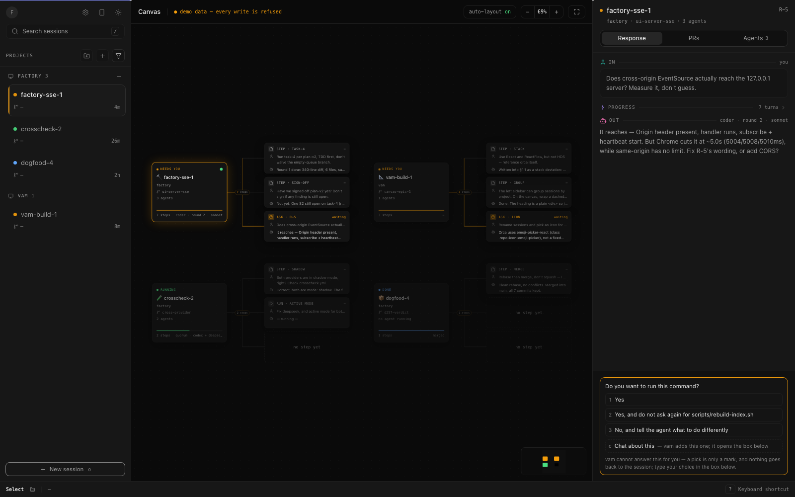
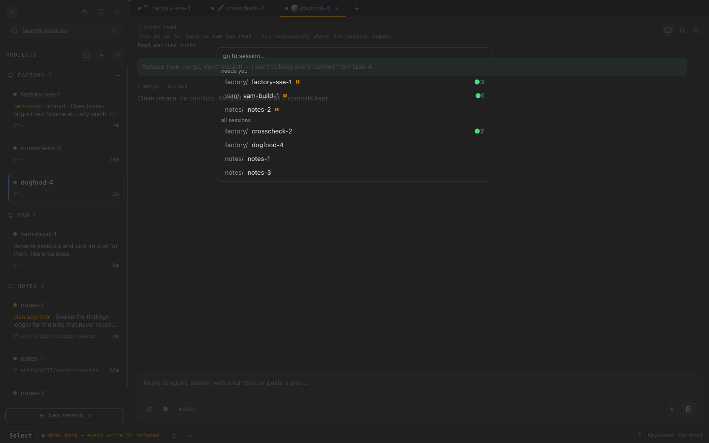
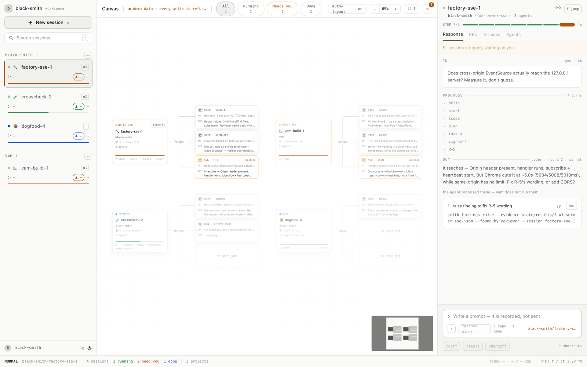

# vam — VIM Agent Management

vam is a keyboard-first ADE (agent development environment) for managing
agent sessions from any CLI: one screen that lays out every running session
as a node, colours it by whether it needs you, and lets you navigate and act
on it with vim-style keys instead of a mouse.



## What this is

Running several agents at once turns into a stream of terminals to babysit
for the one moment each of them stalls and needs a person. vam's job is to
collapse that into a single canvas — one node per session, grouped by
project, coloured `running` / `waiting` / `done` / `failed` — and to make the
`waiting` state impossible to miss, so getting from "something needs me" to
looking at it and answering it takes as few keystrokes as possible.

vam is source-agnostic by design: it draws its canvas from a domain model
that any CLI's session log can be translated into, not from one factory's
internals. black-smith — the project that builds vam — is the first CLI
wired up this way, because dogfooding vam on its own build process is the
fastest way to find its rough edges. See "Relationship to orca" and "Adding
a source" below for how that seam is meant to grow.

vam does not run agents and does not orchestrate anything. It is a read/write
window onto a session log that must already exist somewhere.

## Screenshots



`Mod-k` opens a command palette (`cmdk`) with a jump list of every session,
grouped into "needs you" and "all sessions".



The same canvas in light theme, toggled from the sidebar footer.

The canvas itself (dark screenshot above) has: a left sidebar of sessions
grouped by project with a search box; status filter chips (All / Running /
Needs you / Done) with live counts; the node canvas with auto-layout, zoom
controls and a minimap; a right detail panel with Response / PRs / Terminal /
Agents tabs, a step progress bar and a prompt composer; a bottom status line
showing the current vim-style mode (`NORMAL`), the focused session, and
session counts.

## Quick start

Requires Node >=22.

### Demo mode — no backend needed

```bash
pnpm run dev
# open http://127.0.0.1:5273/?demo=1
```

Demo mode renders a fixed fixture (`src/fixtures/demo.ts`). It needs no
running black-smith. Every write is refused before it reaches any server, and
the canvas shows a banner saying so — this mode is for looking, not for
recording anything.

### Live mode — against a running black-smith

```bash
smith ui serve   # from your black-smith checkout; defaults to :4680
pnpm run dev
# open http://127.0.0.1:5273/
```

Live mode is the default (no `?demo=1`). The dev server proxies `/api/*` to
black-smith's `ui/server`. If black-smith isn't reachable, live mode shows
nothing and says why — it never falls back to fake data.

## Keyboard reference

Bindings are defined in `src/keyboard/chords.ts`. `hjkl` move the focused
node on the canvas the way they always do.

| Key | Action |
|---|---|
| `h` `j` `k` `l` | Move focus left / down / up / right |
| `i` | Put the caret in the prompt box, aimed at the focused session |
| `I` | Move keyboard control into the right-hand action pane |
| `H` | Move keyboard control back to the session list |
| `r` | Rename the focused session |
| `s` | Pick the focused session's icon |
| `x` | Close the focused session |
| `o` | Start a new session |
| `,` | Open settings |
| `f` | Jump (open the jump list) |
| `G` | Jump to the last session |
| `/` | Search |
| `n` / `N` | Next / previous search match |
| `Enter` | Open the focused session |
| `Mod-k` | Open the command palette |
| `Escape` | Cancel whatever is half-typed |

Chord prefixes — press the first key, then the second:

| Chord | Action |
|---|---|
| `gg` | Jump to the first session |
| `gt` | Next project |
| `gT` | Previous project |
| `yy` | Copy (the focused session's reference) |

`Mod` means Ctrl or Cmd, whichever your platform uses.

## The black-smith adapter

The only source wired up today is black-smith, so this section describes how
that one adapter connects — not how vam works in general. Adding another
source means adding another section like this one.

vam's own dev server (Vite) proxies every request to `/api/*` on its own
origin to black-smith's `ui/server`, which defaults to
`http://127.0.0.1:4680`. This is deliberate, not incidental: `ui/server`
sends no CORS headers, so a direct cross-origin request from the browser
would need black-smith to open itself up. Proxying instead keeps black-smith
exactly as closed as it already is.

Two environment variables control the target, and they are not
interchangeable:

- `VAM_SMITH_URL` — read by `vite.config.ts` when the dev/preview server
  starts. Points the proxy at a black-smith running somewhere other than
  `127.0.0.1:4680`.
- `VITE_SMITH_URL` — a build-time override baked into the client bundle,
  for the case where vam itself is served from behind something that
  already fronts a factory (so no proxy is needed at all).

vam **reads** `/api/stream` (an SSE feed), `/api/overview`, `/api/timeline`,
`/api/kanban`, `/api/tasks/:id`, and `/api/lessons`.

vam **writes** to `/api/prompt`, `/api/waivers/apply-batch`, and
`/api/lessons/:id/:to`.

The prompt box is labelled "Write a prompt — it is recorded, not sent", and
on success the status line says the prompt was recorded into the session's
log. This is not a UI shortcoming: black-smith has no channel into a running
agent session, so `/api/prompt` records what you typed into the event log for
the agent to pick up on its own next step. vam cannot make an idle agent act
on your prompt any faster than the agent already checks its log.

## Relationship to orca

orca is the model for being CLI-agnostic — an ADE that isn't tied to any one
source — and vam builds on orca's core rather than reimplementing it. The
parts orca has already solved — connecting to the CLI, session handling,
provider login, remote control — are taken from there, which keeps this repo
focused on the canvas and the keyboard layer sitting on top of them. The
intent is for vam to become independent of orca over time; for now, orca's
core is the foundation.

What is *wired today* is narrower than that intent, and worth stating plainly
so the code doesn't surprise you. The vocabulary is already borrowed:
`src/keyboard/chords.ts` takes orca's keybinding conventions, and the model
treats "a decision waiting for a person" as first-class the way orca does.
`SourceId` in `src/domain/model.ts` already has an `'orca'` case. But the
adapter that would populate it (`src/adapter/to-canvas.ts`) only ever sets
`source: 'black-smith'` — its comment says "orca is a second adapter's job",
and that adapter is not written yet. Every session in the screenshots above
came out of black-smith.

## Adding a source

`src/adapter/` is the seam a new source plugs into: `to-canvas.ts` translates
a CLI's own API shapes into the source-agnostic domain model in
`src/domain/model.ts`, which is all the canvas ever renders. That seam exists
today, but it is not finished — three concrete things still couple the rest
of the code to black-smith specifically:

- `SourceId` in `src/domain/model.ts` is a closed union of exactly
  `'black-smith' | 'orca'`, not an open source type.
- `src/canvas/source.ts` and `src/canvas/Canvas.tsx` import `SmithClient` /
  `SmithApiError` concretely, so the canvas layer is still coupled to the
  black-smith client type, not just the domain model.
- `src/adapter/to-canvas.ts` hardcodes `source: 'black-smith'` on every
  project it builds.

A second adapter needs all three loosened before it can drop in cleanly.

## Development

```bash
pnpm run dev             # start the dev server on :5273
pnpm run build           # production build
pnpm run preview         # serve the production build on :5274
pnpm run typecheck       # tsc --noEmit
pnpm run typecheck:test  # typecheck the test sources
pnpm run lint            # biome check .
pnpm run test            # vitest run
pnpm run test:coverage   # vitest run --coverage
```

Tests use Vitest; run a single file directly with
`node_modules/.bin/vitest run <path>` if you don't want the whole suite.

### End-to-end tests

The Playwright suites in `e2e/` need a one-time manual setup and are **not**
covered by `pnpm install`: there is deliberately no `e2e/package.json`, so a
fresh clone has no `e2e/node_modules` and the scripts below will not run until
you create one. `e2e/README.md` has the steps and explains why the layout is
this way.

Once the harness exists:

```bash
pnpm run test:e2e            # the canvas suite
pnpm run test:e2e:reconnect  # the SSE drop/reconnect suite
```

Neither runs in CI, for the same reason — plus one suite needs a sibling
repository that is not public. `.github/workflows/ci.yml` says so in its header
rather than leaving the gap unexplained.

## Project status

Early: `package.json` is still at `0.0.0`. It is marked `private` so it can't
be published to npm by accident — vam is an application, not a library — which
is separate from the licence.

## Licence

[MIT](LICENSE).
