<div align="center">


# vam

**A keyboard-first agent manager — every Claude Code and Codex session on this machine, in one place.**

[-black)](#-build-from-source)
[](https://www.electronjs.org/)
[](LICENSE)

[Features](#-features) · [Download](#-download) · [Build from source](#-build-from-source) · [Keyboard](#️-keyboard-shortcuts) · [Architecture](#-architecture) · [License](#-license)

</div>

---

<div align="center">
  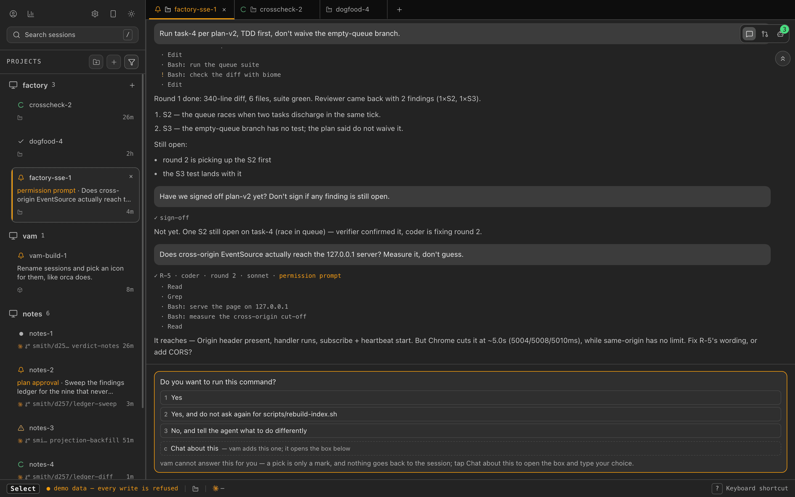
</div>

## Why vam

Claude Code and Codex offer no channel into a running session — no API to watch, no hook
to reach in. So vam starts each one inside a **tmux pane it tags**, types your prompts into
it the same way you would at a keyboard, and reads the transcript back out of the pane with
`capture-pane`. That's what "terminal-first" means here: the terminal *is* the source of
truth, not a wrapper drawn over one.

vam only shows sessions **it started itself** — pick a provider, hit Start, and it's vam's
from then on; anything you launched by hand stays out of the list until you ask to see it.
And because every session already lives in a real tmux pane, it doesn't have to stay on
your laptop: turn on phone access and the same live session keeps going in your pocket,
over your own tailnet — no separate mobile build, no relay run by anyone else.

## ✨ Features

<table>
<tr>
<td width="42%" valign="middle">

### Terminal-first sessions — Claude Code and Codex

Every session is a real tmux pane vam starts, types into, and reads back. Pick a provider,
pick a permission mode — **Manual** asks before every tool call, **Yolo** skips that
provider's own prompts for this session only — and hit Start. Nothing runs until you do.
The Terminal tab is the literal pane, scrollback and all — `capture-pane`, not a rendering
of it.

</td>
<td>
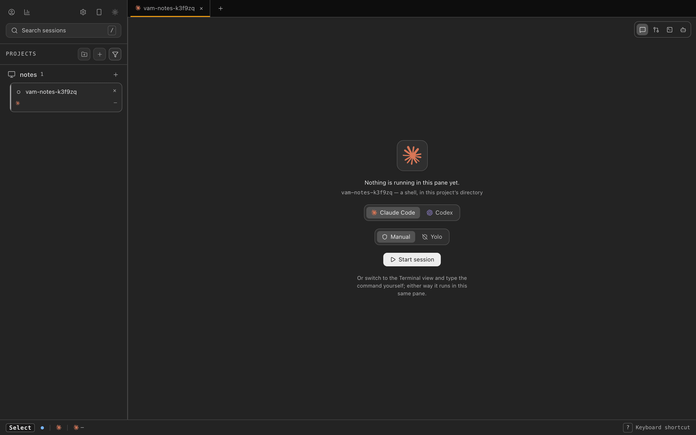<br/>
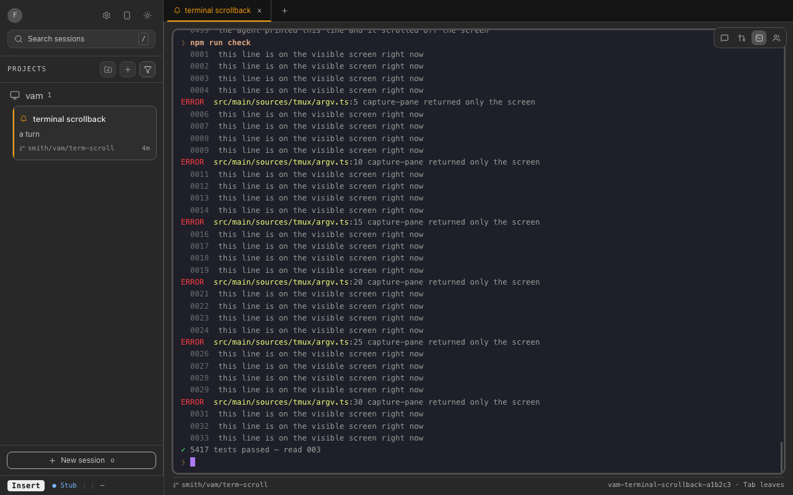
</td>
</tr>
<tr>
<td width="42%" valign="middle">

### Agent status and usage

The avatar bar's own popover reads both providers' rate limits side by side — the 5-hour
window, the weekly window, and (for Claude) the weekly Opus-scoped one — each with its own
reset countdown. The same numbers roll up into a dedicated **Stats & Usage** section inside
Settings.

</td>
<td>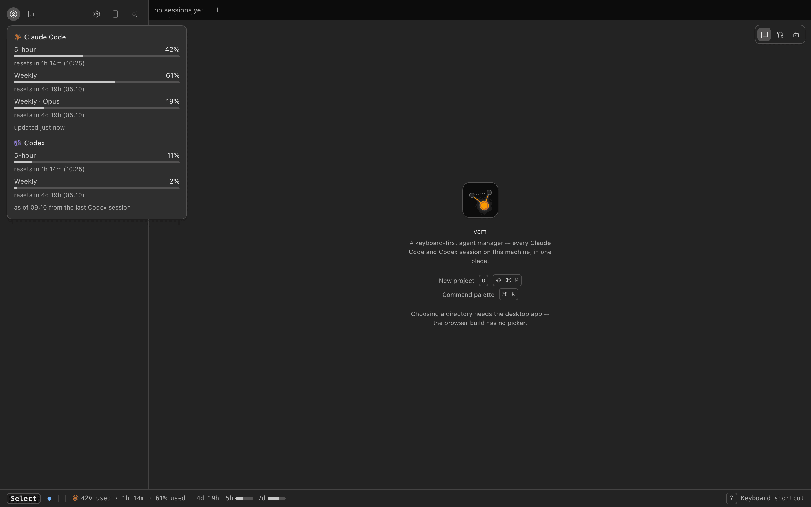</td>
</tr>
<tr>
<td width="42%" valign="middle">

### Questions and permissions, right in the transcript

When an agent needs a decision — a permission prompt or an `AskUserQuestion` — it lands as
a card inline in the transcript: pick one of its options, or open **Chat about this** to
answer in your own words instead. vam never answers for you; a pick is only a mark until
the agent reads it back.

</td>
<td>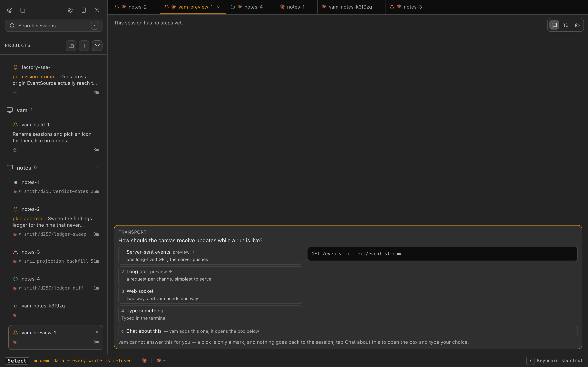</td>
</tr>
<tr>
<td width="42%" valign="middle">

### Workspace options — worktrees and filters

Group sessions by status or by project, sort them, and filter with six independent
toggles — hide agent-started sessions, sessions not started by you, ended sessions,
sessions outside vam, sleeping sessions, or a project's own agent worktrees. Worktrees nest
under their parent project in the sidebar, each with its own status.

</td>
<td>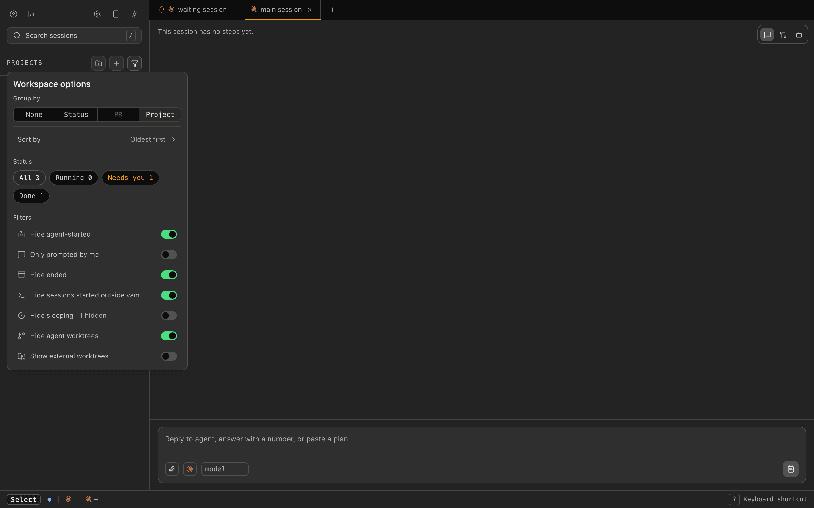</td>
</tr>
<tr>
<td width="42%" valign="middle">

### Your phone, too — over Tailscale Serve

Turn on phone access in **Settings → Remote** and vam runs `tailscale serve` for you,
putting the app behind a private `https://…ts.net` address on your own tailnet. Scan the
QR (or type the address), request a code from the desktop, and pair — the phone then drives
the same live sessions: read a transcript, answer a question, watch an agent finish.

</td>
<td>
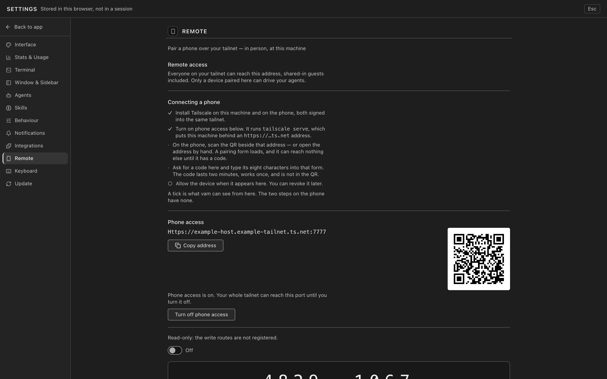<br/>
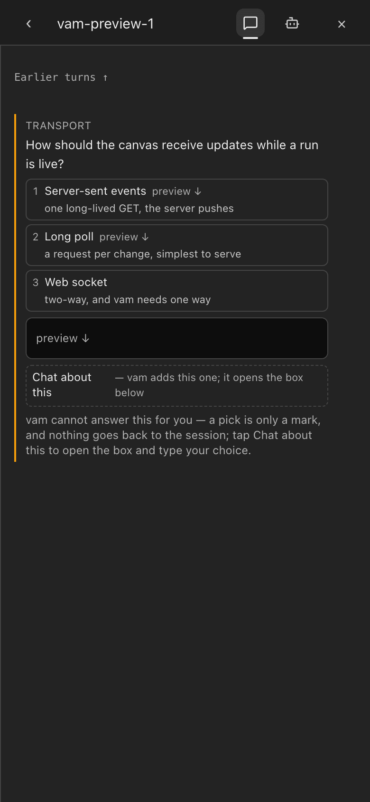
</td>
</tr>
<tr>
<td width="42%" valign="middle">

### Settings — one full-window overlay

`,` opens Settings as its own full-window screen, not a modal over the app — **Interface**
(theme, palette templates, zoom), **Stats & Usage**, **Terminal**, **Window & Sidebar**,
**Agents**, **Skills**, **Behaviour**, **Notifications**, **Integrations**, **Remote**,
**Keyboard**, and **Update**, each its own section behind one sidebar.

</td>
<td>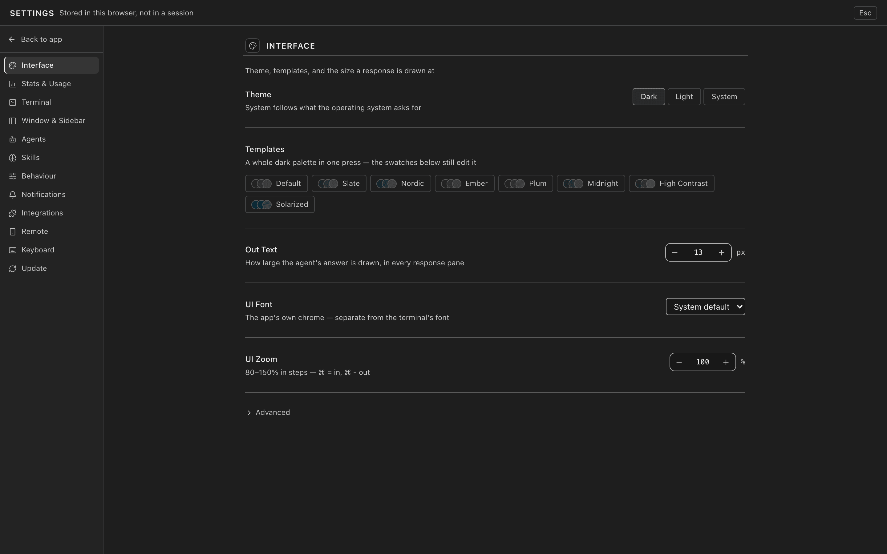</td>
</tr>
<tr>
<td width="42%" valign="middle">

### Integrations — GitHub and GitLab

Connect a GitHub account with the `gh` CLI, or a GitLab account with `glab` — vam stores no
token of its own, it shells out to whichever CLI you're already signed into, and shows pull
requests for the project's linked repo.

</td>
<td>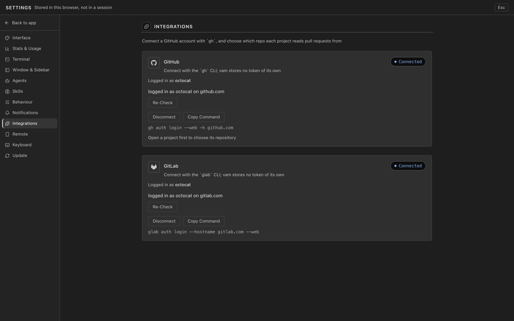</td>
</tr>
<tr>
<td width="42%" valign="middle">

### Keyboard — Insert mode, shortcuts, a conflict indicator

**Select** mode moves with `hjkl` and vim-style prefix chords (`gg`, `yy`, `zs`/`zv`…); `i`
drops you into **Insert**, where the same keys type into the prompt or answer a question
instead, and `Escape` leaves Insert and hands the keyboard straight back rather than
reaching the session's own pane. `Mod-.` is the dedicated way to interrupt the focused
session instead — it sends Escape to its pane. `?` opens a searchable sheet generated from
the same key tables that back every binding, and in **Settings → Keyboard**, a chord two
actions claim is flagged with a red dot and a tooltip naming the other action — on both the
row that kept the chord and the row that lost it.

</td>
<td>
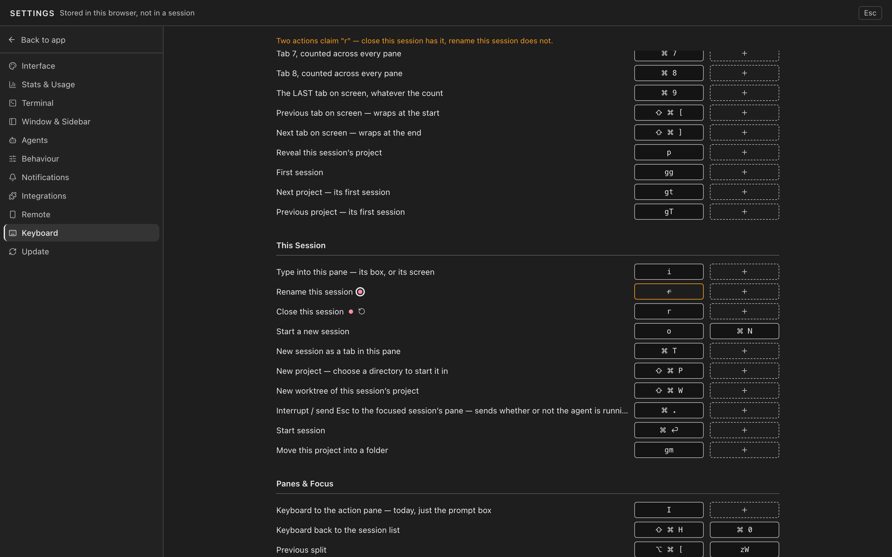<br/>
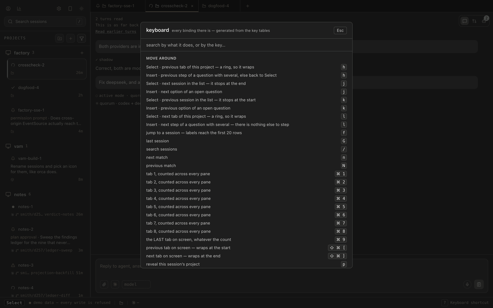
</td>
</tr>
</table>

## 📦 Download

vam has no published releases yet. The release workflow drafts unsigned macOS, Windows and
Linux builds automatically from a tag — a maintainer still has to choose to publish one —
so for now the only install is [building from source](#-build-from-source).

## 🛠 Build from source

Requires Node.js 22 (`.nvmrc` pins it) and `tmux` on `PATH` — every session is a real tmux
pane, and desktop mode also wants `claude` and/or `codex` on `PATH` for whichever provider
you start.

```bash
nvm use              # or install node 22 some other way
pnpm install
pnpm run dev          # browser build, on :5273
pnpm run dev:app      # the Electron shell, with renderer HMR
pnpm run build        # production browser build, into dist/
pnpm run build:app    # electron-vite build, into out/
pnpm run build:web    # the phone/web bundle, into dist-web/ (what Remote serves)
pnpm run dist         # build:app + build:web + electron-builder -> an unsigned local .dmg
```

`pnpm run dist` produces a `.dmg`/`.zip` on macOS, unsigned — right-click → **Open** on
first launch (Gatekeeper otherwise refuses it; there is no Apple Developer identity behind
these builds yet).

## ⌨️ Keyboard shortcuts

`Mod` is your platform's command modifier — Cmd on macOS, Ctrl elsewhere. Every binding
below is generated from the same key tables the in-app `?` sheet reads, so it can't drift
from what's actually bound:

| Key | Action |
| --- | --- |
| `j` `k` | Walk the session list |
| `h` `l` | Cycle the focused project's open tabs |
| `i` | Enter Insert — type into the prompt, or answer a question |
| `Escape` | Leave Insert, back to Select — never into the session's pane |
| `Mod-.` | Interrupt the focused session — sends Escape to its pane |
| `o` / `Mod-n` | Start a session in the focused project |
| `x` / `Mod-w` | Close the focused session |
| `Mod-Shift-p` | New project |
| `Mod-Shift-w` | New worktree |
| `/` | Search sessions · `n` / `N` next / previous match |
| `F` | Workspace options — group, sort, status, filters |
| `,` | Settings · `.` Remote (phone pairing) |
| `Mod-k` | Command palette |
| `Ctrl-Alt-1` … `Ctrl-Alt-9` | Jump to a view — Response, PRs, Terminal, Agents, Files… |
| `zs` `zv` | Split the focused tab, stacked or side by side |
| `?` | The in-app sheet, generated from the same bindings |

**[docs/keyboard.md](docs/keyboard.md)** has every chord — a test
(`test/keyboard/chords.keyboard-doc.test.ts`) fails the unit suite if that file and the key
tables ever disagree, so it can't go stale silently.

## 🏗 Architecture

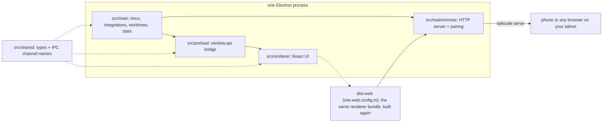
```mermaid
flowchart LR
    subgraph Shell["one Electron process"]
        Main["src/main: tmux, integrations, worktrees, stats"]
        Preload["src/preload: window.api bridge"]
        Renderer["src/renderer: React UI"]
        Remote["src/main/remote: HTTP server + pairing"]
    end
    Main --> Preload
    Preload --> Renderer
    Main --> Remote
    Renderer -.-> Web["dist-web (vite.web.config.ts): the same renderer bundle, built again"]
    Web --> Remote
    Remote -- tailscale serve --> Phone["phone or any browser on your tailnet"]
    Shared["src/shared: types + IPC channel names"] -.-> Main
    Shared -.-> Preload
    Shared -.-> Renderer
```

- **`src/main`** — the Electron shell: starts and reads tmux panes (`src/main/terminal`),
  shells out to `gh`/`glab` (`src/main/integrations`), manages git worktrees
  (`src/main/worktrees`), polls provider usage (`src/main/stats`, `src/main/usage`).
- **`src/preload`** — the only bridge; everything the renderer can call hangs off
  `window.api`.
- **`src/renderer`** — the React UI. The exact same bundle also builds standalone as the
  **phone/web build** (`vite.web.config.ts` → `dist-web/`) — capability checks like
  `isDesktopShell()` turn off what only Electron can do (a native file picker, reading a
  tmux pane directly) rather than shipping a second UI.
- **`src/main/remote`** — an HTTP server (`server.ts`) that serves that same `dist-web`
  build and pairs devices (`pairing.ts`); `serve.ts` puts it behind a private
  `https://…ts.net` address by shelling out to `tailscale serve`. No relay, no vam-run
  server — the tunnel is your own tailnet.
- **`src/shared`** — the types and IPC channel names all three contexts import.

## 🤝 Contributing

There's no `CONTRIBUTING.md` yet — the real gate is what CI runs
(`.github/workflows/ci.yml`), so run the same commands locally before opening a PR:

```bash
pnpm run lint             # biome check . (e2e/ is intentionally excluded)
pnpm run typecheck        # src, with the DOM lib
pnpm run typecheck:node   # main + preload, no DOM lib
pnpm run typecheck:web    # renderer
pnpm run typecheck:test   # test/
pnpm test                 # vitest unit suite
pnpm run build            # production build
pnpm run test:app         # the Electron launch harness (spawns a real binary)
pnpm run test:e2e:web     # e2e/run-web-guards.mjs — the asserting e2e/*.mjs scripts
pnpm run test:e2e         # Playwright, desktop
pnpm run test:e2e:phone   # Playwright, 390px
pnpm run test:e2e:electron # Playwright against a packaged electron-builder --dir build
```

See [`e2e/README.md`](e2e/README.md) for what each e2e script actually checks (and the
handful that are screenshot-only and intentionally not gates).

## 📜 License

[MIT](LICENSE).
